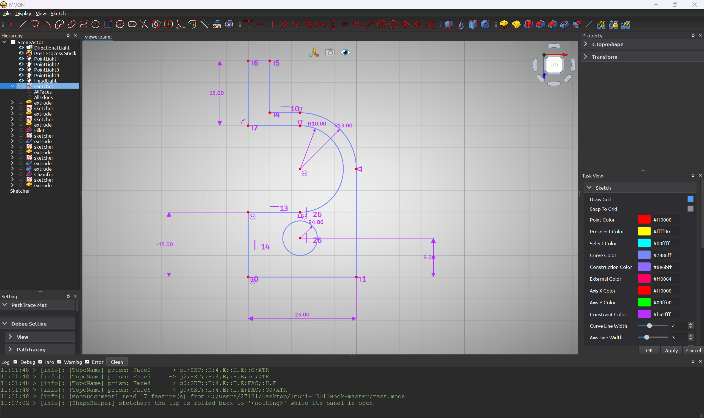
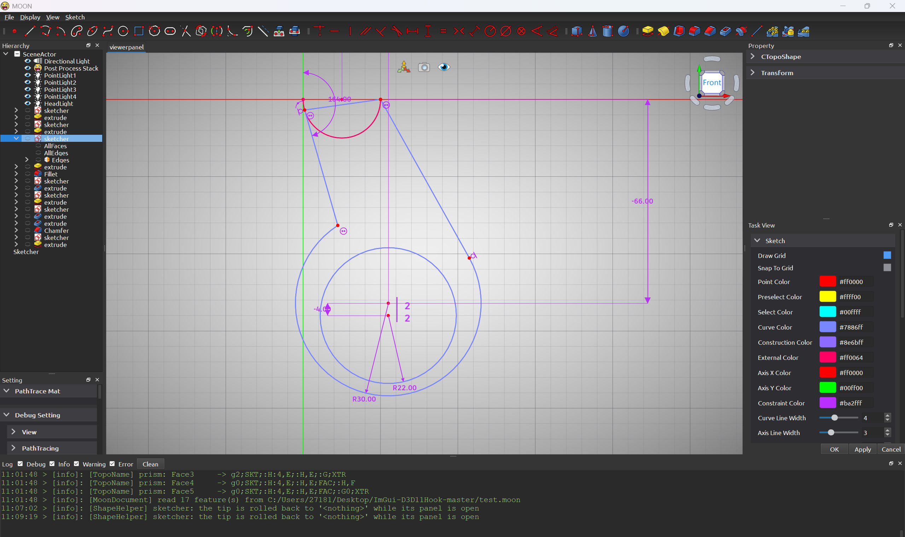
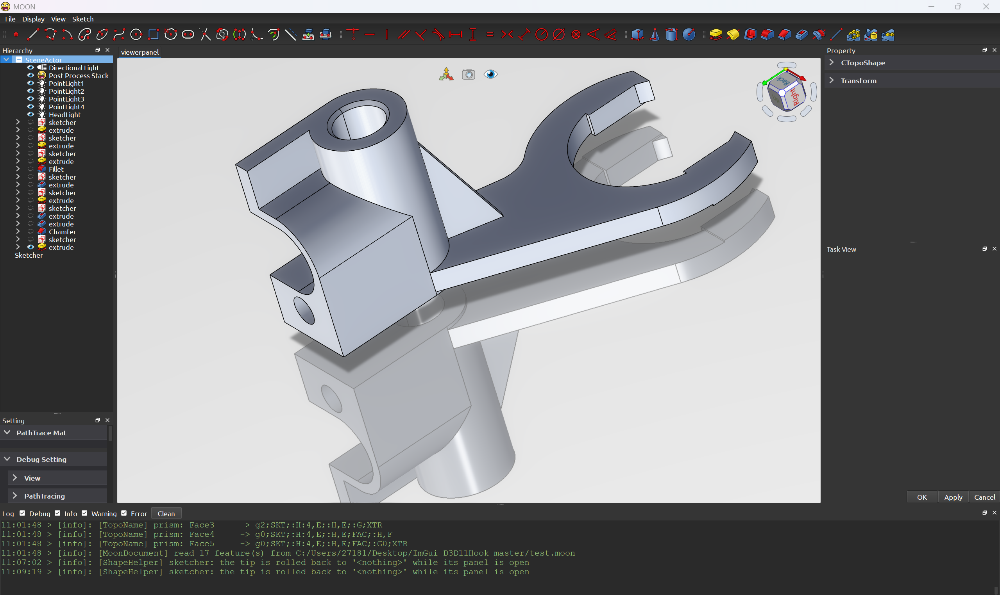
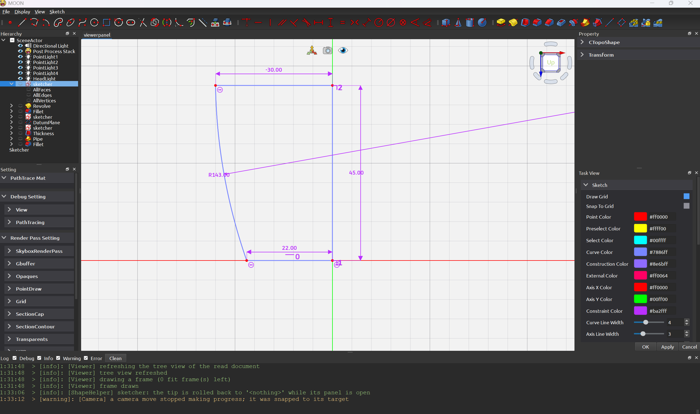
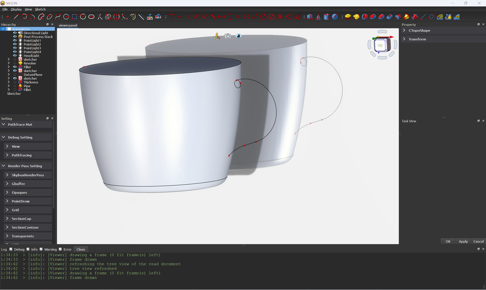
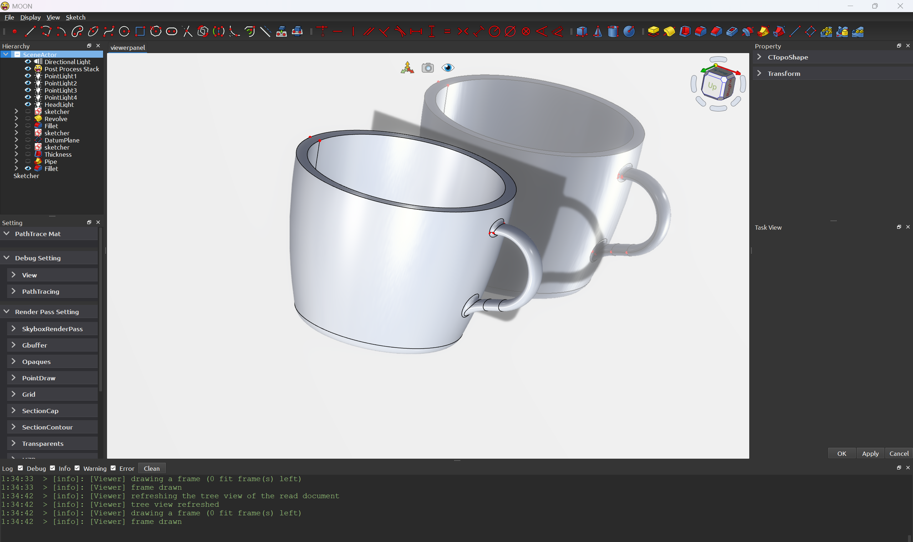
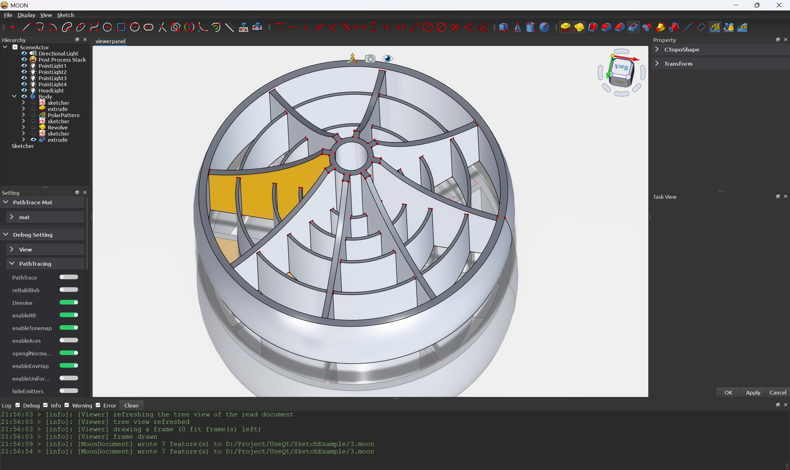
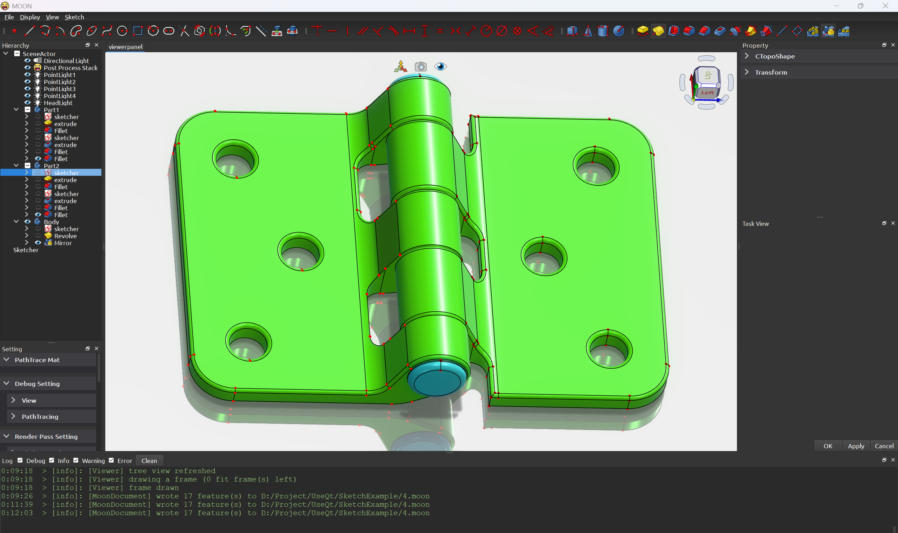

# Moon Render（MOON CAD）

基于 Qt + OpenGL 的参数化 CAD 建模与渲染项目，主线是「草图 → 特征 → 实体」，外加自研的 PBR / 路径追踪渲染。
几何内核使用 OpenCascade（OCC），UI 基于 Qt Widgets，3D 交互与叠加绘制走自研的交互 Widget 体系（Im3D 立即模式渲染）。

模型按**参数化特征链**组织：文档（`.moon`）里存的是特征、参数和引用关系而不是冻结的几何，
打开文档时按链重算；相机、材质这类渲染状态属于渲染层，不进文档。

---

## 功能清单

### 草图（Sketcher）

- [x] 绘制：点 / 直线 / 折线 / 圆 / 圆弧 / 椭圆 / 样条 / 矩形 / 正多边形 / 腰形槽 / 圆弧槽 / 裁剪 / 圆角 / 偏移 / 旋转 / 对称
- [x] 编辑：端点 / 边 / 圆心拖动（各自的编辑语义不同）、构造几何切换（Toggle Construction Geometry）、连续绘制
- [x] 吸附：端点 / 中点 / 交点 / 网格，以及外部几何、坐标轴与原点
- [x] 外部几何：把已有边投影进草图当参考（External Geometry），以及外部几何与本草图的相交（External Intersection）
- [x] 约束：Coincident / Horizontal / Vertical / Parallel / Perpendicular / Tangent / Equal / Symmetric / DistanceX / DistanceY / Length / Radius / Diameter / Angle / Block，
      外加智能尺寸（Dimension，连续标注）；求解走 GCS（DogLeg），求解失败可回退，几何删除联动清理约束
- [x] 圆锥曲线的内部几何：画完椭圆自动暴露中心 / 长轴 / 短轴 / 焦点（构造几何，可标注长轴、短轴）
- [x] 草图随文档存读（曲线 + 约束 + 平面 + 网格开关），读回来还能继续编辑

### 特征（PartDesign 风格）

| 分类 | 特征 |
| --- | --- |
| 基于轮廓 | **Pad / Pocket**（长度 / Through All / UpToFace；正向 / 反向 / 双向 / 对称）、**Revolve / Groove**（轴：Sketch X / Sketch Y / 拾取边） |
| 扫掠 | **Additive Pipe / Subtractive Pipe**：截面草图 + 路径（整条路径草图，或拾取它的一条边），模式 Standard / Fixed / Frenet / Binormal，转角 Transformed / Right Corner / Round Corner |
| 修饰 | **Fillet / Chamfer**（半径 / 尺寸 + 参考边列表：面板里能继续拾取加边、移除、Clear、Use ALL Edges）、**Thickness**（Skin / Pipe / RectoVerso，Arc / Intersection 接合，反向、相交） |
| 基准 | **Datum Line**、**Datum Plane**（ObjectXY / XZ / YZ、FlatFace、ThreePoints、NormalToEdge + 偏移 / 绕法向旋转 / 自动尺寸），附着可以取面、边或顶点 |
| 变换 | **Polar Pattern / Linear Pattern / Mirror**，whole（整体复制后融合）与 feature（只重复特征自己的料，默认，同 FreeCAD）两种模式 |

- [x] 特征链：一个 body 内的特征按顺序堆叠，上游改动会把下游重算；树里可 Move Up / Move Down 调序（依赖不满足时拒绝）
- [x] 编辑已有特征时回滚 tip（隐藏本特征、露出下面的形状），确定后再前滚
- [x] 拓扑命名：子形状引用（`Edge_n` / `Face_n` / `Vertex_n`）连同映射名一起记住，重算、存盘、读盘之后仍指向同一个元素
- [x] 实时预览：改参数或拖 3D 箭头即时重建，差异几何用半透明预览
- [x] refine：结果提交时合并共面 / 共线元素（对齐 FreeCAD 的 Refine 开关）

### Body 与文档

- [x] 多 body：一个场景可以有多个 body，各自一条特征链；File → New Body 新建，树里右键 "Active Body" 切换活动 body，新建的特征进活动 body
- [x] 树的右键菜单：Rename（行内改名，body 与 feature 都支持）、Delete、Move Up / Move Down、Copy / Paste（body 深拷贝，特征之间的引用关系一并复制）
- [x] 文档 `.moon`：存参数化特征链——特征类型与参数、特征之间的链接、子形状引用与映射名、body 节点的放置、每个特征自己的 pose、显隐状态；
      不存 B-Rep / 网格，读回时整链重算（相机、材质等渲染状态不在文档里）
- [x] 导入：STEP / OBJ / GLTF 等；打开文档或导入模型后自动构建场景查询（BVH）并 fit 视角
- [x] 导出：STL / STEP（导出选中对象）

### 渲染

- [x] PBR + IBL（天空盒 / 辐照度 / 预过滤环境贴图）
- [x] PathTrace（GPU fragment）+ OIDN 降噪（可开关，含降噪帧数设置）
- [ ] PathTrace（CPU / CUDA）——`MoonTracer` 里有独立的追踪实验程序，还没并进 Moon.exe
- [x] SSAO（深度感知采样 + 7×7 模糊，可开关）
- [x] 合批渲染（BatchedMesh：同一 shape 的面 / 线 / 点合并成合批 mesh，配可见性索引支持按拓扑节点显隐与拾取）
- [x] 透明渲染（depth peel 深度剥离）
- [x] 剖切截面渲染（模板奇偶填充截面 + 几何着色器逐三角形求交截线，拾取同步按剖切面过滤）
- [x] 阴影（反射平面）
- [x] 后处理：Bloom / FXAA / Tonemap / Auto Exposure
- [x] HZB 遮挡剔除（上一帧深度金字塔 + BVH 分层节点测试，PBO 环形缓冲异步回读）
- [x] reverse-Z 深度 + 多边形偏移，解决线与面共面时的 z-fighting
- [ ] LOD / 网格简化等性能优化

### 交互与选择

- [x] GPU id 拾取：面 / 边 / 顶点，点选 / 框选 / 悬停高亮（线与面共面时线优先）
- [x] 顶点可视化：每个顶点画成圆点（默认红色、大小 8，颜色与大小在材质面板改），拾取到的顶点可以当参考用（例如给基准面选附着点）
- [x] 交互 Widget：ViewCube、剖切平面（ClipPlane）、平移 / 旋转手柄（AxisTranslationWidget 等）
- [x] 相机：环绕 / 平移 / 缩放 / 视角切换动画 / Fit to focus

### 编辑器 UI

- [x] 菜单：File（Open / Save / Save As / Export / New Body）、Display、View、Sketch
- [x] 工具栏：草图、草图约束、基本体（Box / Sphere / Cylinder / Cone）、建模（Pad / Pocket / Revolve / Groove / Additive Pipe / Subtractive Pipe / Thickness / Fillet / Chamfer / Datum Line / Datum Plane / Polar Pattern / Linear Pattern / Mirror）
- [x] 任务面板：每个特征一个参数面板（Inviwo 风格折叠组 + 拖动数字控件 + 视图里的 3D 箭头），确定 / 取消 / 预览
- [x] 属性面板（材质 / 变换等组件）
- [x] 设置面板（折叠组分层：材质 / 调试 / 渲染 Pass）
- [x] 日志面板（Level / Time / Message 三栏，按级别过滤与着色）
- [x] 层级树（无线条、统一箭头、行内改名、右键菜单、body / feature 排序与显隐）
- [x] 自定义 Dock 标题栏

---

## 架构文档

| 文档 | 内容 |
| --- | --- |
| [docs/InteractiveWidget.md](docs/InteractiveWidget.md) | 交互 Widget 体系：事件层 / 绘制层 / 拾取 / 状态机（ClipPlane 为例） |
| [docs/ScreenWidget.md](docs/ScreenWidget.md) | 2D 覆盖层交互控件架构：分层 / 坐标系统一 / 光标来源 / 状态机 / 光标归属仲裁 / 扩展步骤 |
| [docs/SketchModelingWidget.md](docs/SketchModelingWidget.md) | 草图建模 Handler 深入解析：事件 → 交互 → 曲线 → 预览 → 提交 |
| [docs/SketchModelingWidgetArchitecture.md](docs/SketchModelingWidgetArchitecture.md) | 草图建模架构总览（分层与依赖、设计模式） |
| [docs/SketchWidgets/README.md](docs/SketchWidgets/README.md) | 各草图工具专项文档（Point/Line/LineSet/Circle/Ellipse/Polygon/Slot/ArcSlot/BSpline/Rectangle/Fillet/Symmetry/Rotate/Offset/Trimming） |
| [docs/SketchConstraints.md](docs/SketchConstraints.md) | 草图约束：原理 / 架构 / 工作流 / 用法 / 一致性规则（求解器、删除清理、拖动锚点、setDatum） |
| [docs/SketchRendering.md](docs/SketchRendering.md) | 草图绘制：曲线 / 点 / 构造虚线 / 约束与尺寸标注 |
| [docs/SketchInteraction.md](docs/SketchInteraction.md) | 草图交互：拾取 / 吸附 / 几何拖动（端点、边、圆心的编辑语义） |
| [docs/SketcherObj.md](docs/SketcherObj.md) | `SketcherObj` 的职责划分、功能清单与开发计划（对照 FreeCAD 的 SketchObject / ViewProviderSketch） |
| [docs/FeatureModeling.md](docs/FeatureModeling.md) | Feature 参数化建模：预览逻辑 / 建模 / 任务 UI / 属性系统 |
| [docs/BatchedMesh.md](docs/BatchedMesh.md) | 合批 Mesh 与拓扑交互控制：显隐 / 高亮 / 拾取在合批下如何工作 |
| [docs/DepthPrecision.md](docs/DepthPrecision.md) | 大场景深度精度：动态近远平面 + Reversed-Z，以及线面冲突的解法 |
| [docs/SectionRendering.md](docs/SectionRendering.md) | 剖切截面渲染（模板 / 奇偶裁剪） |
| [docs/HzbOcclusionCulling.md](docs/HzbOcclusionCulling.md) | HZB 遮挡剔除：深度金字塔 / BVH 分层测试 / PBO 异步回读 / 偏置与统计 |
| [docs/mass-entity-render-perf.md](docs/mass-entity-render-perf.md) | 海量实体场景的渲染性能方案（与本引擎无关的通用整理） |
| [docs/DevelopmentLog.md](docs/DevelopmentLog.md) | 开发工作记录：渲染（渲染效果 / 性能优化）与建模两大主题的工作归档 |
| [docs/todo.md](docs/todo.md) | 待办与已知取舍（渲染计划、草图遗留、文档格式的第二期取舍等） |
| [docs/ImguiArchitecture.md](docs/ImguiArchitecture.md) | ImGui 集成架构 |
| [docs/API.md](docs/API.md) | API 索引 |

---

## 目录结构

| 目录 | 内容 |
| --- | --- |
| `Moon/` | 编辑器与建模层。`feature/`（特征、body、`.moon` 文档）、`Sketcher/`（草图数据与约束求解）、`Interactive/`（3D 交互 Widget、草图绘制 handler）、`editor/`（Qt UI：面板 / 工具栏 / 命令 / 层级树）、`renderer/`（各渲染 pass）、`core/`（`TopoShape` 组件、`ViewTool`、日志） |
| `MoonRender/` | 自研渲染引擎：ECS（Actor / 组件）、资源管理（Model / Material / Texture / Shader）、渲染 pass 框架、HAL、数学库、场景序列化 |
| `MoonGeomerty/` | OCC 几何层：`TopoShape` 及其扩展（布尔、离散化、拓扑命名）、`Base::Matrix4D` 等 |
| `MoonTracer/` | 独立的路径追踪实验程序（自带 OIDN），不属于 `Moon.exe` |
| `Extern/` | 第三方库（assimp / spdlog / tinygltf / tinyxml2 / ImGui 等），随构建自动编译 |
| `cmake/` | 平台相关脚本（`OpenCascadeWin.cmake` 等） |
| `docs/` | 架构文档，见上表 |
| `SketchExample/` | 示例 `.moon` 文档 |

---

## 构建说明

### 依赖

| 依赖 | 版本 | 说明 |
| --- | --- | --- |
| Visual Studio | 2022（MSVC v143） | 编译器 |
| CMake | ≥ 3.12（建议 3.28） | 构建系统 |
| Qt | 5.15.2 `msvc2019_64` | Qt Widgets / Gui / OpenGL / Svg |
| OpenCASCADE | 7.9.3（x64，含 3rd-party DLL） | 几何内核 |
| Eigen / Boost | 3.4.0 / 项目自带 | `Extern/` 下 |
| spdlog / assimp / tinygltf 等 | 由 `Extern/` 子目录自动构建 | 无需手动安装 |

语言标准 C++20（MSVC `/bigobj`）；OpenCASCADE 通过 `cmake/OpenCascadeWin.cmake` 查找，不走 `find_package`。
项目由多个目标组成：`Moon`（编辑器主程序）、`MoonRender`（渲染引擎）、`MoonGeomerty`（OCC 几何层）、`MoonTracer`（独立追踪实验）。

### 配置与编译

```bat
:: 1. 配置（OpenCASCADE_DIR 指向含 env.bat 的目录）
cmake -S . -B Build -DOpenCASCADE_DIR=D:/path/to/opencascade-7.9.3

:: 2. 构建（目标 Moon；Release）
cmake --build Build --target Moon --config Release -- /m /nologo

:: 3. 运行
Build\bin\Release\Moon.exe
```

> 提示：
> - 首次构建会自动编译 `Extern/` 下的 spdlog / assimp / tinygltf 等第三方库，耗时较长；
> - 运行时若提示缺少 OCC 或 3rd-party DLL，把 OpenCASCADE 的 bin 目录加入 `PATH`；
> - 编译前请关闭正在运行的 Moon.exe，否则链接会因文件占用失败。

---

## 截图

### OCC 几何建模

















### 交互 Widget 架构


